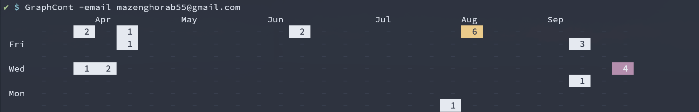

# contributions-graph

A Local Go application that generates a beautiful contribution graph for the past 6 to 12 months directly in the Terminal.



**Go version:** Go 1.24.4

**External Dependencies:** `github.com/go-git/go-git/v5`

---

## How to Run

1. Clone the repository:
   ```bash
     git clone https://github.com/Mazinghorab/contributions-graph
   ```
   
2. Navigate into the directory:
   ```bash
     cd contributions-graph
   ```   

3. Install and Build the application:
  ```bash
    go install
    go build
  ```

4. Configure the local repositories and email:
  ```bash
    ./GraphCont -add /path/to/your/Directory
    ./GraphCont -email your@gmail.com
  ```

**In the future it will be remote**
